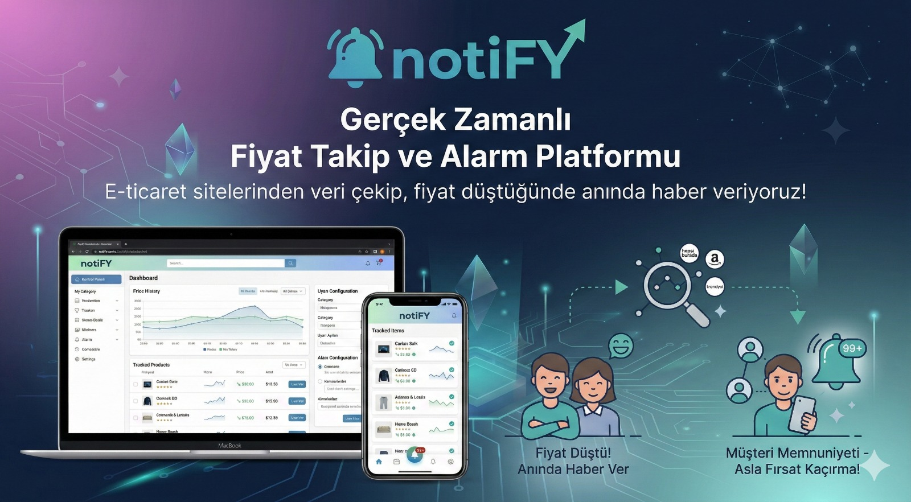

# notiFY

---

## Proje Hakkında

**Proje Tanımı:** 
Tüketicilere ve e-ticaret profesyonellerine, piyasadaki anlık fiyat değişimlerini kaçırmadan en doğru zamanda aksiyon alma imkanı sunar. Platformumuz; çeşitli e-ticaret pazaryerlerinden ve kategorilerden (Go ve Redis altyapısıyla) saniyesi saniyesine veri çekerek, Redis ve Kafka/RabbitMQ tabanlı asenkron bir mimari üzerinden fiyat dalgalanmalarını analiz eder.
Gelişmiş mikroservis yapısı sayesinde, kullanıcıların belirlediği limitlerin altına inen fiyatlar anında tespit edilir ve entegre bildirim sistemleriyle ( E-mail) kullanıcıya "satın alma sinyali" olarak iletilir. Amacımız, manuel fiyat takibi zahmetini ortadan kaldırarak, veriye dayalı alışverişi herkes için erişilebilir ve dinamik bir deneyime dönüştürmektir.

**Örnek:** 

**Proje Kategorisi:** 
Finans Teknolojileri (FinTech) / Veri Madenciliği / Akıllı Bildirim Sistemleri

**Referans Uygulama:** 
> [Örnek Referans Uygulama]Cimri, Akakçe

---

## Proje Linkleri

- **REST API Adresi:**
- **Web Frontend Adresi:**

---

## Proje Ekibi

**HERMES** 

**Ekip Üyeleri:** 
- Ercan Aziz
- Sema Durgut
- Doğukan Dursoy
- Betül Erkoç
- Nisanur Sütçü

---

## Dokümantasyon

Proje dokümantasyonuna aşağıdaki linklerden erişebilirsiniz:

1. [Gereksinim Analizi](Gereksinim-Analizi.md)
2. [REST API Tasarımı](API-Tasarimi.md)
3. [REST API](Rest-API.md)
4. [Web Front-End](WebFrontEnd.md)
5. [Mobil Front-End](MobilFrontEnd.md)
6. [Mobil Backend](MobilBackEnd.md)
7. [Video Sunum](Sunum.md)

---
